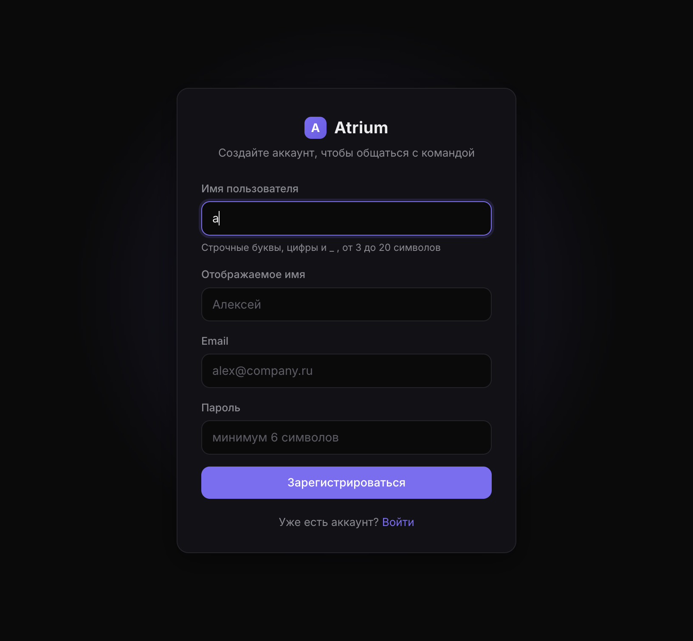

# Atrium

Тёмный минималистичный мессенджер для организаций и компаний.


Создавайте свою компанию, назначайте роли, приглашайте людей — они подписывают
договор своим подписью от руки — и общайтесь: чаты, аудио- и видеозвонки.

## Возможности

- **Организации** — создание своей группы/компании с описанием; публичные и приватные.
- **Каталог организаций** — поиск групп, подача заявления на вступление.
- **Роли** — Владелец, Помощник владельца, Админ, Помощник админа, Участник;
  подробная матрица прав (раздел «Роли и права» в приложении).
- **Договоры с подписью от руки** — приглашение и заявление на вступление
  подписываются договором (ФИО + нарисованная подпись), **увольнение** — отдельный
  договор, который подписывает сам сотрудник; есть односторонний разрыв для штата.
- **Профиль с сохранённой подписью** — напечатайте подпись или нарисуйте один раз,
  потом подписывайте документы в один клик (с подсказкой для новичков).
- **Чаты** — общие каналы и личные сообщения, реалтайм, индикатор набора,
  **отметки «Прочитано» и счётчики непрочитанных**.
- **История действий** — кто и когда приглашал, принимал, подписывал, повышал,
  увольнял, удалял (раздел «История» в организации).
- **Звонки** — видеозвонки и аудиозвонки 1:1 на WebRTC (STUN + бесплатный TURN
  для соединения между разными сетями).
- **Присутствие** — онлайн-статусы участников.
- **Кошелёк и зарплата** — пополнение с карты, переводы участникам,
  казначейство организации и выплаты зарплаты сотрудникам с историей операций.
- **Банковский счёт** — вывод на свою банковскую карту и пополнение с неё
  (номер карты не хранится — только маска; исходящие операции подтверждаются PIN).
- **Бот-модератор** — удаляет нецензурные сообщения в канале, присылает
  уведомления об удалении и оценку переписки; события модерации попадают
  в журнал действий.
- **Бан с причиной** — администратор банит участника только с обязательной
  причиной; пользователь получает уведомление «Вас забанил(а) … Причина: …».
- **Панель создателя (только для вас)** — бот-отчётчик в ЛС + подробнейший журнал:
  кто и когда вошёл (IP, устройство), кто что сделал во всех организациях,
  статистика, бан/разбан пользователей, настройки событий бота.
- **Тёмный минималистичный интерфейс** — без светлой темы, тонкие границы, фиолетовый акцент.
- **Адаптив** — полноценно работает с телефона, планшета и компьютера по одной ссылке.

## Публичная ссылка

Постоянная ссылка на приложение (без страниц-предупреждений, HTTPS):

```
https://aleksejyanover.github.io/atrium/
```

Интерфейс размещён на GitHub Pages, а API и чат идут через туннель к серверу
на вашем компьютере (работает, пока запущены сервер и туннель). Адрес туннеля
подставляется автоматически: `start.sh` обновляет `docs/config.js` и пушит его
при каждом запуске.

Запуск/перезапуск одной командой из корня репозитория:

```bash
./start.sh   # поднимает сервер + туннель и обновляет адрес API на Pages
```

Состояния: сервер — `/tmp/atrium-server.log`, туннель — `/tmp/atrium-tunnel.log`.
После перезапуска туннеля API-адрес изменится — `./start.sh` сам опубликует
новый (Pages подхватывает через ~1 минуту).

## Структура

| Папка    | Что это |
|----------|---------|
| `server/`| Node.js: REST API + Socket.IO + SQLite (better-sqlite3), JWT, bcrypt |
| `web/`   | Веб-приложение: Vite + React 18 + TypeScript |
| `mobile/`| Мобильное приложение: Expo (React Native) + expo-router |

Общая спецификация протокола — [SPEC.md](./SPEC.md).

## Запуск

Нужен Node.js 20+.

### 1. Сервер

```bash
cd server
npm install
npm run dev        # http://localhost:4000
# проверка: curl http://localhost:4000/api/health  → {"ok":true}
# тесты:    npm run smoke   (сервер должен быть запущен)
```

База SQLite создаётся автоматически в `server/data/atrium.db`.

### 2. Веб

```bash
cd web
npm install
npm run dev        # http://localhost:5173  (проксирует /api и /socket.io на :4000)
```

Сборка: `npm run build` → статика в `web/dist`; запущенный сервер отдаёт её сам
(открывайте http://localhost:4000).

### 3. Мобильное

```bash
cd mobile
npm install
npx expo start
```

Скан QR-кода в Expo Go. Адрес сервера задаётся через `EXPO_PUBLIC_API_URL`,
например `EXPO_PUBLIC_API_URL=http://192.168.1.10:4000 npx expo start`
(IP вашего компьютера в локальной сети — телефон должен быть в той же сети).

Подробности — в [mobile/README.md](./mobile/README.md).

## Роли и права

| Роль | Права |
|------|-------|
| Владелец (owner) | всё: любые роли, редактирование организации, увольнение, односторонний разрыв договоров |
| Помощник владельца | приглашать, принимать заявления, увольнять (ниже себя), редактировать организацию, создавать каналы, удалять сообщения |
| Админ | приглашать, принимать заявления, увольнять (ниже себя), создавать каналы, удалять сообщения, редактировать организацию |
| Помощник админа | приглашать, принимать заявления, создавать каналы, удалять сообщения |
| Участник | чаты, звонки, каталог, подача заявлений, история действий |

## Ограничения

- Звонки только 1:1; используется бесплатный публичный TURN — на очень сложных
  сетях соединение может не установиться (будет понятная ошибка, а не вечный «Вызов…»).
- Нет загрузки файлов и групповых звонков.
- Подпись хранится в базе как изображение (`data:image/...`).

## Технологии

Server: Node.js, Express, Socket.IO, better-sqlite3, JWT, bcryptjs.
Web: React 18, Vite, TypeScript, socket.io-client, WebRTC.
Mobile: Expo, expo-router, React Native, react-native-webrtc, react-native-svg.
